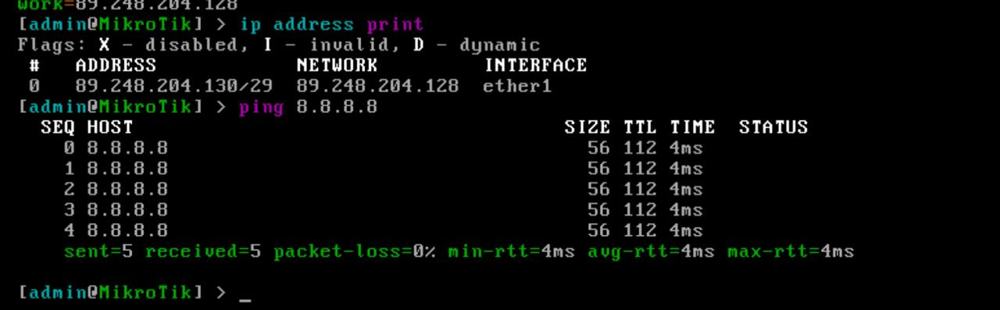
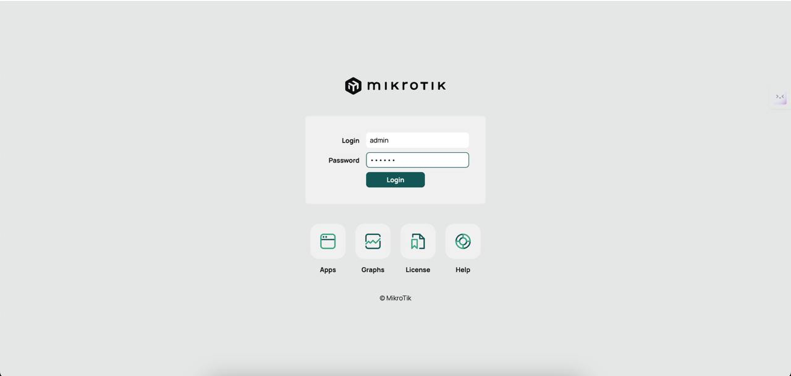
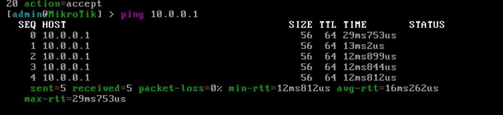
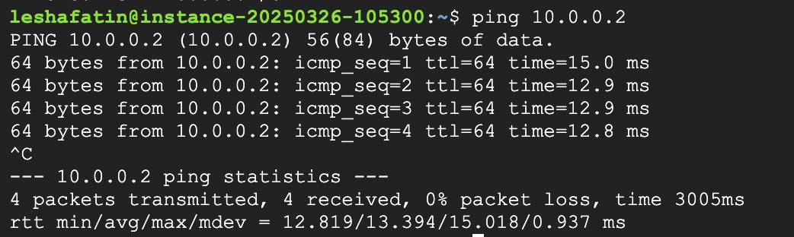

University: [ITMO University](https://itmo.ru/ru/)

Faculty: [FICT](https://fict.itmo.ru)

Course: [Network programming](https://github.com/itmo-ict-faculty/network-programming)

Year: 2024/2025

Group: K3320

Author: Fatin Alexey Andreevich

Lab: Lab1

Date of create: 20.03.2025

Date of finished: 26.03.2025

# Отчёт по лабораторной работе №1 "Установка CHR и Ansible, настройка VPN"

***Цель:*** развернуть виртуальную машину на базе платформы Microsoft Azure с установленной системой контроля конфигураций Ansible и установить CHR в VirtualBox


## Ход работы


### Подготовка CHR сервера

В связи с ленью автора CHR был установлен не в VirtualBox, а развернут в облаке в Selectel. Для этого использовался [этот гайд](https://selectel.ru/blog/mikrotik-chr-install/).



CHR был успешно подготовлен для дальнейшей настройки. Важная деталь - необходимо было установить версию RouterOS > 7.X, так как только в нем присутствует Package WireGuard'a. Можно конечно обновиться изнутри, но раз мы разворачиваем с нуля, то почему бы сразу не выбрать нужную версию.

у CHR есть GUI доступный через WinBox, либо онлайн-админка, доступная по IP сервера. В данном случае была использована консоль. 

Админка: 




### Подготовка сервера автоматизации 

Был использован GCP, в нем поднят базовый сервер на Ubuntu с предельно низкими спеками


### Настройка сервера автоматизации 

Выполняем на сервере автоматизации: 

```
sudo apt update 
sudo apt upgrade

sudo apt install wireguard

wg genkey | sudo tee /etc/wireguard/private.key

sudo cat /etc/wireguard/private.key | wg pubkey | sudo tee /etc/wireguard/public.key
```

Затем определяем конфиг WireGuard'a:

```
[Interface]
PrivateKey = <приватный ключ, полученный выше>
Address = 10.0.0.1/24
ListenPort = 40000
PostUp = iptables -A FORWARD -i wg0 -j ACCEPT; iptables -t nat -A POSTROUTING -o eth0 -j MASQUERADE
PostDown = iptables -D FORWARD -i wg0 -j ACCEPT; iptables -t nat -D POSTROUTING -o eth0 -j MASQUERADE

[Peer]
PublicKey = <публичный ключик CHR роутера>
AllowedIPs = 10.0.0.2/32
```

Стартуем сервис WireGuard'a:

```
sudo sysctl -w net.ipv4.ip_forward=1
sudo ufw allow 40000/udp

sudo systemctl enable wg-quick@wg0
sudo systemctl start wg-quick@wg0
```

### Настройка роутера 

Настраиваем интерфейсы на роутере: 

```
# вот отсюда берем публичный ключ для конфига выше
/interface wireguard add name=wg0  

/interface wireguard print
/ip address add address=10.0.0.2/24 interface=wg0 

/interface wireguard peers add interface=wg0 public-key="<публичный ключ сервера автоматизации>" endpoint-address=<IP сервера автоматизации> endpoint-port=40000 allowed-address=10.0.0.0/24                                     

/ip firewall filter add chain=input protocol=icmp action=accept
/ip firewall filter add chain=input protocol=udp dst-port=40000 action=accept    
```

## Проверка работоспособности

Пинг с роутера в сервер автоматизации 



В обратную сторону на всякий 


