University: [ITMO University](https://itmo.ru/ru/)

Faculty: [FICT](https://fict.itmo.ru)

Course: [Network programming](https://github.com/itmo-ict-faculty/network-programming)

Year: 2024/2025

Group: K3320

Author: Fatin Alexey Andreevich

Lab: Lab3

Date of create: 26.04.2025

Date of finished: 27.04.2025

# Отчёт по лабораторной работе №3 "Развертывание Netbox, сеть связи как источник правды в системе технического учета Netbox"

***Цель:*** С помощью Ansible и Netbox собрать всю возможную информацию об устройствах и сохранить их в отдельном файле.

## Ход работы

### Создание и настройка устройств 

Проделаем по сути содержание двух первых лабортаорных работ, создадим 2 CHR, один сервер автоматизации. 
Впоследствии нужно еще будет создать сервер, на котором будет запущен NetBox. 

Базово проверим связанность

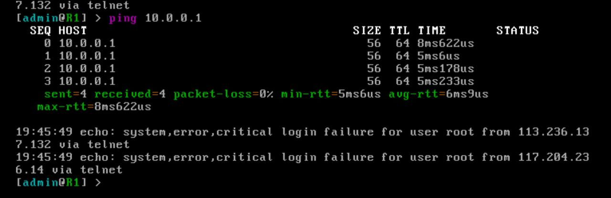
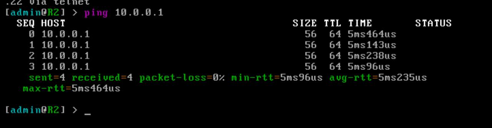
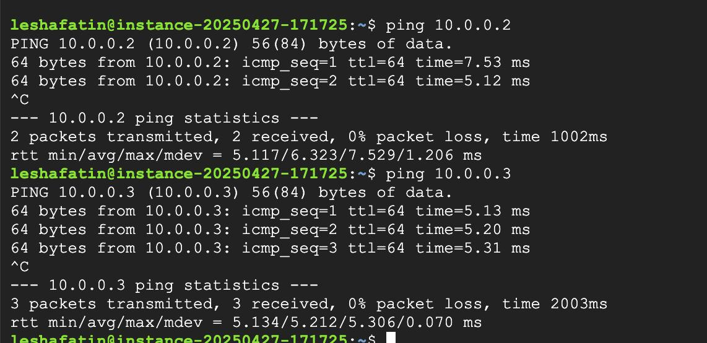

### Разворачивание NetBox

Создадим еще одну ВМ, развернем [NetBox](https://github.com/netbox-community/netbox-docker) по гайду 

Создадим супер-юзера и зайдем в GUI

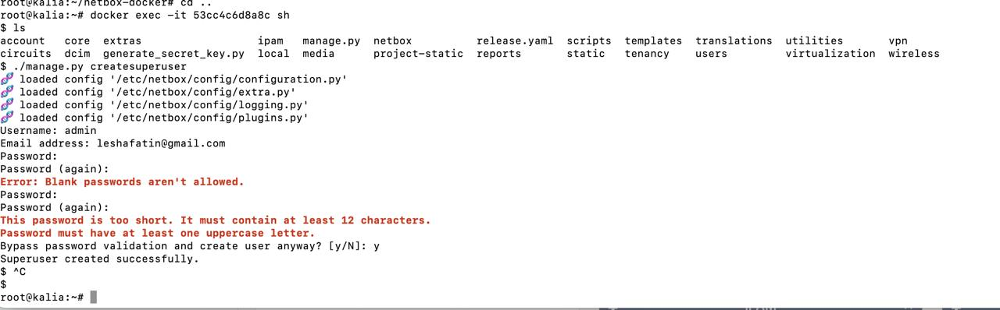
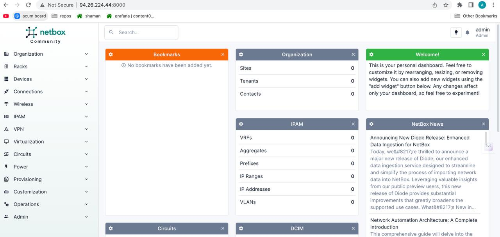

Заполним инфу о наших CHR

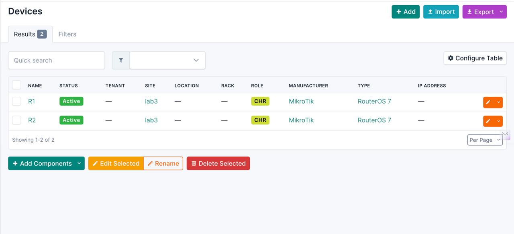

### Сохранение информации о девайсах 

Создадим [плейбук](./assets/inv-to-netbox.yml)

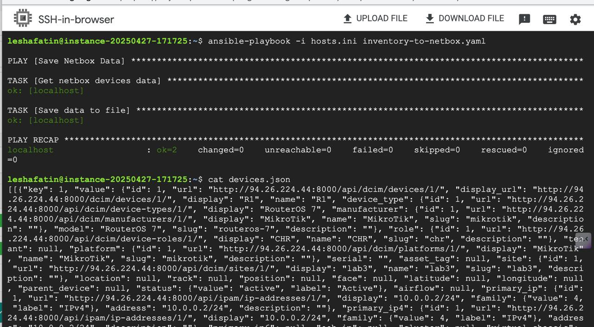

Выведем в [json](./assets/devices.json)

### Переименование девайсов 

Создадим [плейбук](./assets/rename.yml)

Запустим

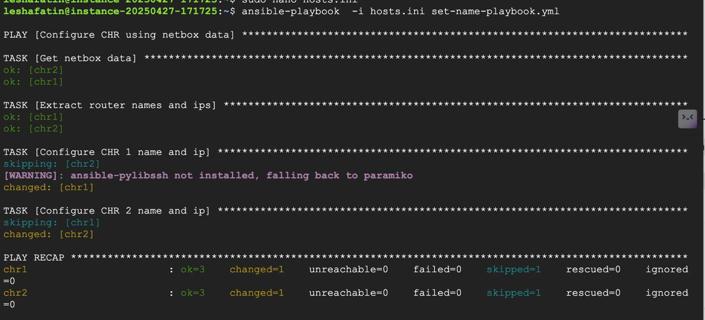
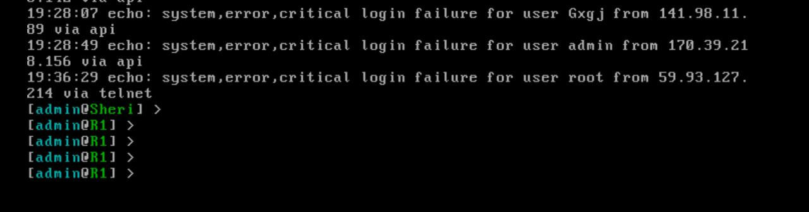
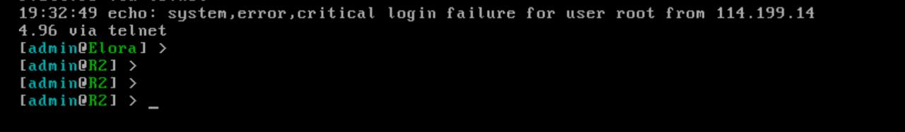

### Сбор серийных номеров устройств

Создадим [плейбук](./assets/serial-num.yml)

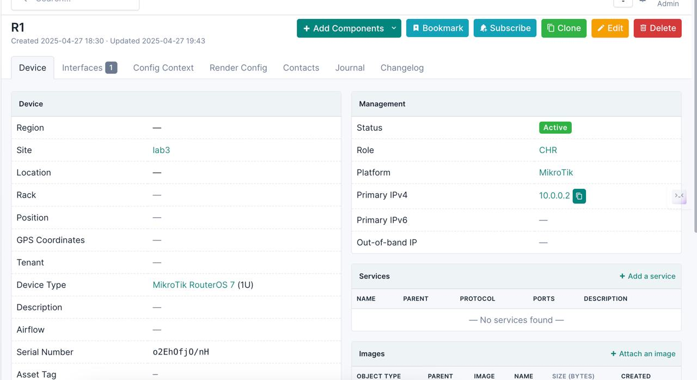
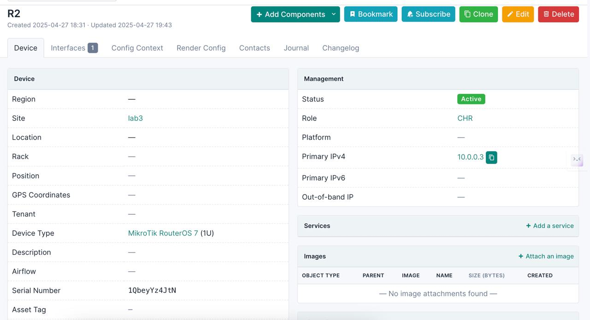

### Схема

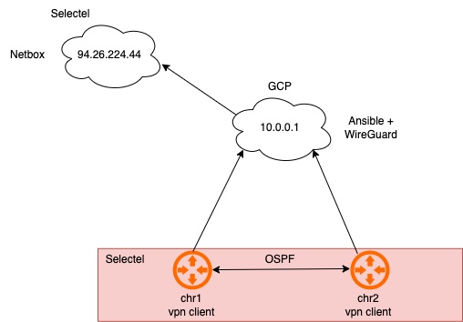

