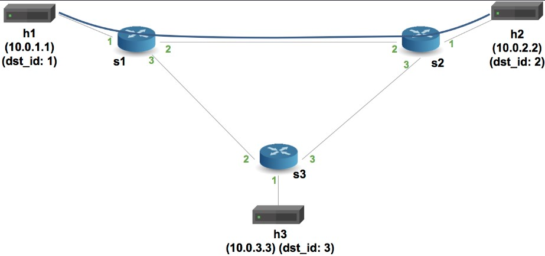

University: [ITMO University](https://itmo.ru/ru/)

Faculty: [FICT](https://fict.itmo.ru)

Course: [Network programming](https://github.com/itmo-ict-faculty/network-programming)

Year: 2024/2025

Group: K3320

Author: Fatin Alexey Andreevich

Lab: Lab4

Date of create: 08.05.2025

Date of finished: 10.05.2025

# Отчёт по лабораторной работе №4 "Базовая 'коммутация' и туннелирование используя язык программирования P4"

***Цель:*** Изучить синтаксис языка программирования P4 и выполнить 2 задания обучающих задания от Open network foundation для ознакомления на практике с P4.

## Ход работы

### Подготовка среды 

Благостно, что и vagrant, и VirtualBox есть как минимум на x86 MacOS, можно больше не тратить кровные деньги на аренду ВМ. 

Установим vagrant и VirtualBox

Склонируем репозиторий [p4lang/tutorials](https://github.com/p4lang/tutorials), поднимем через vagrant ВМ на Ubuntu20.04 

> Здесь позволим себе лирическое отступление, отчет писался после выполнения ЛР и это сейчас все гладко и легко. Возможно это какая-то неудача и месть судьбы, но просто следуя туториалу невозможно дойти до шага с mininet'ом. Там все разваливается и трещит, нужно править Makefile, какие-то мелкие утилитки, чтобы оно наконец заработало

Оно запустилось, ура!

### Implementing Basic Forwarding

Изучим подготовленные материалы задания, а именно [basic.p4](https://github.com/p4lang/tutorials/blob/master/exercises/basic/basic.p4).

Поверхностно, он состоит из нескольких разделов: 
- header: описывает заголовки 
- parser: извлекает нужные поля из пакетов 
- ingress: содержит таблицу ipv4, где происходит match по hdr.ipv4.dstAddr
- actions: либо ipv4_forward, либо drop пакета
- deparser: собирает пакетик обратно

[Заполним todos в шаблоне](./assets/basic.p4)

В начале программа определяет заголовки Ethernet и IPv4, которые извлекаются из входящего пакета парсером. В блоке управления MyIngress осуществляется поиск IP назначения в таблице ipv4_lpm с помощью алгоритма наилучшего совпадения по префиксу. В зависимости от найденного правила выполняется действие ipv4_forward, в котором подменяется MAC-адрес назначения и указывается порт, на который следует отправить пакет. Если подходящего правила не найдено, срабатывает действие по умолчанию drop, и пакет отбрасывается.

Протестируем работу:

### Implementing Basic Tunneling

[Заполним todos в шаблоне](./assets/basic_tunnel.p4)

Здесь мы реализуем туннелирование IP-пакетов с использованием пользовательского заголовка myTunnel с типом вложенного протокола и идентификатормо назначения. В зависимости от того, содержит ли пакет туннельный заголовок, применяется разная логика маршрутизации. Обычные IPv4-пакеты направляются с использованием таблицы ipv4_lpm. Туннелированные пакеты обрабатываются таблицей myTunnel_exact, где пересылка выполняется на основе точного совпадения по dst_id. 

Запустим терминалы h1 и h2 с помощью `xterm h1 h2`

Отправим пакетик с h1, просмотрим его содержимое на h2

Видим, что это обычный IPv4 пакет и там нет нашего заголовка туннеля

Теперь на h1 выполним: `./send.py 10.0.2.2 "P4 is cool" --dst_id 2`

Здесь уже появляется заголовок туннеля!

А теперь выполним `./send.py 10.0.3.3 "P4 is cool" --dst_id 2`. Мы указываем IPv4 h3, но dst_id h2. Посмотрим что будет на h2

Ого!!! Пакет пришел  на h2, хотя мы указывали h3. Все потому, что свитч не использует заголовок IP для роутинга, когда есть MyTunnel
